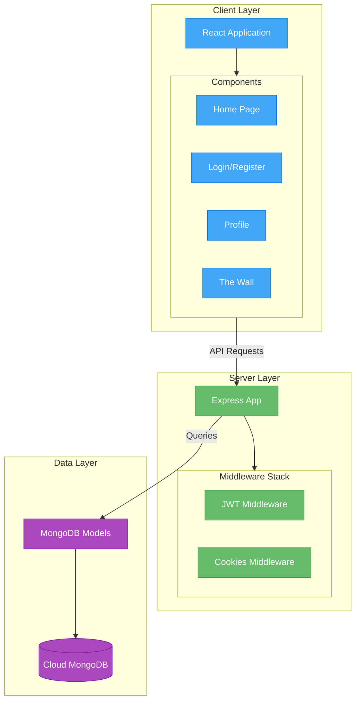

```mermaid
flowchart TD
    %% Styling
    classDef client fill:#42A5F5,color:#fff,stroke:#1976D2
    classDef server fill:#66BB6A,color:#fff,stroke:#388E3C
    classDef database fill:#AB47BC,color:#fff,stroke:#7B1FA2
    
    subgraph Client["Client Layer"]
        direction TB
        React[React Application]:::client
        
        subgraph Components["Components"]
            direction LR
            Home[Home Page]:::client
            Auth[Login/Register]:::client
            Profile[Profile]:::client
            Wall[The Wall]:::client
        end
        
        React --> Components
    end
    
    subgraph Server["Server Layer"]
        direction TB
        Express[Express App]:::server
        
        subgraph Middleware["Middleware Stack"]
            direction LR
            JWT[JWT Middleware]:::server
            Cookie[Cookies Middleware]:::server
        end
        
        Express --> Middleware
    end
    
    subgraph Data["Data Layer"]
        direction TB
        Models[MongoDB Models]:::database
        DB[(Cloud MongoDB)]:::database
        Models --> DB
    end
    
    %% Connections
    Components -->|API Requests| Express
    Express -->|Queries| Models
```
